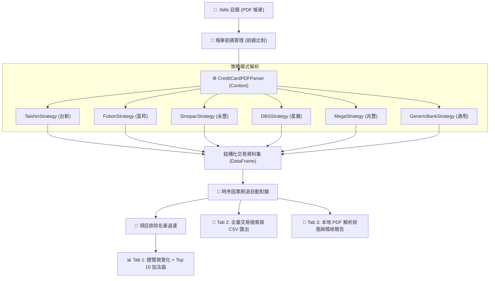

# 💳 信用卡帳單分析報表 (Credit Card Statement Analysis Dashboard)

<p align="center">
  
  
  
  
  
</p>

一套專為個人理財打造的**現代化信用卡帳單分析可視化儀表板**。本機端 100% 離線運算，採用**策略模式（Strategy Pattern）**原生支援台灣各主要銀行加密 PDF 電子帳單自動解讀，結合**時序因果刷退自動對銷**、**即時勾選加法器**、**項目排除名單**與**多銀行密碼智慧配對**，助您精準掌握每筆開銷流向！

---

## 🌟 核心功能特色

### 1. 🏦 策略模式多銀行解析引擎 (Strategy Pattern Parser)
針對各家銀行在 PDF 欄位排版、日期表示、卡號標籤與跨行說明的差異，系統內建專業**策略模式架構**，精準適配各大發卡機構：
- **台新銀行 (Taishin)**：支援民國年雙日期標頭、跨行說明自動回溯接續、卡號末四碼精確擷取。
- **台北富邦 (Fubon)**：完美相容「`[消費日] [說明] [入帳日] [幣別] [台幣金額]`」夾心排版，自動擷取鈦金/御璽卡末四碼。
- **永豐銀行 (Sinopac)**：自動將行末金額與行首卡號末四碼徹底分離，支援 `DAWHO` / `SPORT卡` 及跨年月份自動對齊。
- **星展銀行 (DBS)**：支援西元年雙日期、正負向溢繳/刷卡金折抵，以及多卡號（如傳說對決卡、ECO永續卡）即時切換。
- **兆豐銀行 (Mega)**：支援兆豐信用卡帳單特徵與消費解析。
- **通用銀行備援 (Generic)**：遇未知發卡行自動以多重啟發式規則依序嘗試解析。

---

### 2. 🔑 多銀行密碼智慧管理 (Multi-Bank Password Manager)
- **前綴智慧配對**：依照檔名前綴長度自動匹配最適密碼（例如檔名為 `富邦_202608.pdf` 自動套用 `富邦` 密碼；若無前綴可設定通用預設密碼）。
- **側邊欄視覺化管理**：
  - **行內即時編輯（✏️）與刪除（🗑️）**：原地展開編輯，刪除時下方項目自動向上併齊。
  - **明文眼睛切換**：密碼欄位原生支援點擊眼睛切換遮罩（`••••••`）或明文檢視。
  - **自動持久化**：所有新增與修改即時同步至 `config.json`，並自動重整快取。
- **路徑寫死固定**：PDF 固定讀取專案下的 **`./bills`** 目錄，免去手動輸入路徑的繁瑣步驟。

---

### 3. 📊 現代化視覺分析儀表板 (Overview Dashboard)
- **三大核心 KPI 數據卡片**：
  - **總消費金額**：精確計算有效消費（自動扣除上期繳款與自動對銷項目）。
  - **總消費筆數（點擊展開明細）**：整張卡片為可點擊元件，點擊任意處立即彈出 **原生對話窗 (`st.dialog`)**，即時瀏覽納入統計的完整清單。
  - **單筆最高金額**：自動提取消費冠軍之金額、發卡行與商家名稱，字級隨長度自動縮放。
- **🗓️ 彈性月份篩選器**：
  - 月份選單標籤直接標註所包含的銀行（如 `📅 2026-08 帳單 【台北富邦、台新銀行、永豐銀行】 (88 筆交易)`）。
  - 提供 **「🔘 全選」** 與 **「✖️ 全取消」** 快捷鍵，自由複選後點擊 **「套用」**。
- **📈 每日消費金額分布圖 (Plotly Bar Chart)**：
  - 離散類別 X 軸精準對齊實際交易日，去除無消費日期空檔。柱體上方標註純白高對比度數值字型。
- **🗓️ 帳單月份消費總額圖**：
  - 各月份總支出由舊至新左起排列，選取 5 個月以下自動靠左對齊，版面俐落。

---

### 4. 🧮 Top 10 交易勾選即時加法器 (Interactive SUM Adder)
- **原生多選表格**：在「🔥 最高花費前 10 筆明細」中，直接點擊勾選任意多筆交易。
- **右側浮動計算機 (Sticky Adder)**：
  - 頁面滾動時常駐右上角，即時統計「**已選 N 筆，加總：NT$ XXX**」。
  - 附帶 **「全部重選」** 一鍵清空勾選。
  - 支援 **「收合加法器」**：收合後表格自動延展為全螢幕全寬，隨時可一鍵重新展開。

---

### 5. 🚫 項目排除名單 (Excluded Keywords Filter)
- **自訂黑名單過濾**：
  - 可自由新增特定商家關鍵字（如：大額固定代繳「大安文山有線電視」、水電瓦斯費等），將其排除於首頁統計。
  - 點開側邊欄「🚫 項目排除名單」，支援即時新增、行內編輯與刪除。
  - 排除名單即時持久化至 `config.json`，且僅過濾首頁統計，在「交易明細搜尋」頁籤依然完整保留供隨時查閱。

---

### 6. 🔄 時序因果刷退自動對銷 (Time-Causality Refund Offsetting)
- **嚴謹時序約束演算法**：
  - 一筆退款（$T_{refund}$）**只能抵銷發生在該退款當日或之前（$T_{purchase} \le T_{refund}$）且時間最接近的原始消費**，絕不逆向抵銷未來消費。
  - 支援跨月對銷（例如 8 月初退款成功抵銷 7 月底的消費）。
  - 對銷後的兩筆紀錄自動自統計與圖表中剔除，並於 Tab 3 提供完整的**對銷稽核清單**以供核對。

---

### 7. 📑 交易明細搜尋與 CSV 匯出
- **全額小額保留**：不受首頁過濾門檻限制，完整顯示超商 35 元、手搖杯 50 元等小額紀錄。
- **雙向關鍵字搜尋**：支援商家名稱與備註模糊檢索，自動套用 Unicode NFKC 正規化。
- **發卡銀行明確標註**：每筆明細均標註所屬發卡銀行（台新、富邦、永豐、星展等）。
- **📥 匯出 CSV**：一鍵下載搜尋結果為 UTF-8 格式 CSV 檔。

---

## 🏗️ 系統架構流程圖



---

## 🚀 快速啟動方式

### 方式 A：🪟 Windows 免安裝綠色版（最推薦，免裝 Python！）
本專案已整合 **GitHub Actions 雲端 CI/CD**，自動將最新程式打包成獨立執行檔：
1. 前往本儲存庫的 **[Actions 頁面](https://github.com/r1244460xx/WhyAmIBroke/actions)**，點擊最新一次的 **Build Windows Executable**。
2. 下載頁面下方的 **`CreditCardAnalysis-Windows`** 壓縮檔並解壓縮。
3. 將 PDF 帳單放進解壓後的 `bills/` 資料夾，**雙擊 `CreditCardAnalysis.exe`** 即可立即開啟儀表板！

---

### 方式 B：雙擊腳本一鍵啟動（自動建立虛擬環境）

- **🪟 Windows 使用者**：
  直接雙擊資料夾內的 **`run_dashboard.bat`**。
  *(自動檢查環境、安裝 requirements.txt 並於瀏覽器跳出儀表板)*

- **🍎 macOS 使用者**：
  直接雙擊資料夾內的 **`run_dashboard.command`**（或於終端機執行 `./run_dashboard.sh`）。
  *(自動檢查環境並在 Safari / Chrome 中跳出儀表板)*

---

### 方式 C：💻 開發者手動啟動

```bash
# 1. 建立並啟用 Python 虛擬環境
python3 -m venv venv
source venv/bin/activate       # macOS / Linux
# 或 venv\Scripts\activate     # Windows

# 2. 安裝必要套件
pip install -r requirements.txt

# 3. 啟動 Streamlit 伺服器
streamlit run app.py
```
啟動後瀏覽器造訪 [http://localhost:8501](http://localhost:8501) 即可開始使用！

---

## 📥 帳單放置與密碼前綴配對指南

### 1. 放置 PDF 帳單
請直接將各銀行寄發的電子帳單 PDF 放置於專案根目錄的 **`./bills`** 目錄下。

### 2. 設定檔名與前綴配對規則
系統在解鎖 PDF 時，會依照檔名開頭與密碼前綴進行比對：

| 銀行名稱 | 建議檔名範例 | 密碼管理前綴設定 | 預設密碼規則範例 |
| :--- | :--- | :---: | :--- |
| **台新銀行** | `TSB_Creditcard_202608.pdf` | `TSB` | 身分證後 6 碼或生日 6 碼 |
| **台北富邦** | `富邦_202608.pdf` | `富邦` | 身分證字號全碼（首字母大寫） |
| **永豐銀行** | `永豐銀行信用卡帳單.pdf` | `永豐` | 身分證字號全碼（首字母大寫） |
| **星展銀行** | `星展_202607.pdf` | `星展` | 民國出生年月日 6 碼 + 身分證後 4 碼 |
| **兆豐銀行** | `MEGA_202608.pdf` | `MEGA` | 身分證字號全碼 |
| *(通用備援)* | 任意無法分類的檔名 | *(留空)* | 當特定前綴皆未配對時自動套用 |

> [!TIP]
> 啟動應用後，直接在左側邊欄的 **「🔑 帳單密碼管理」** 點擊 **「➕ 帳單密碼」**，即可在介面上直覺新增、編輯或測試密碼！

---

## ⚙️ 設定檔範例 (`config.json`)

系統自動將您的個人偏好與密碼持久化儲存於本機 `config.json`：

```json
{
  "bill_pdf_dir": "./bills",
  "min_amount_filter": 500,
  "excluded_keywords": [
    "大安文山有線電視股份有限公司"
  ],
  "pdf_passwords": [
    {
      "prefix": "TSB",
      "password": "YOUR_PASSWORD"
    },
    {
      "prefix": "富邦",
      "password": "YOUR_PASSWORD"
    },
    {
      "prefix": "永豐",
      "password": "YOUR_PASSWORD"
    },
    {
      "prefix": "星展",
      "password": "YOUR_PASSWORD"
    }
  ]
}
```

---

## 🛡️ 資安與隱私保護承諾

> [!IMPORTANT]
> **您的財務隱私高於一切。**
> - **100% 本機端運算**：所有的 PDF 解密、消費明細抽取與數據計算**全數在您本機的 Python 進程記憶體中完成**，絕不發送任何資料至任何外部伺服器或第三方服務。
> - **Git 隔離保護**：專案 `.gitignore` 已嚴密排除 `config.json`、`bills/*.pdf`、`venv/`、`.streamlit/` 等機密檔案，您可以安心進行版本控制與程式碼同步，完全無需擔心密碼或帳單外洩。
